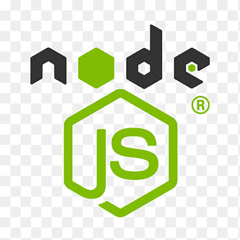

<!-- ✨ MR MAHABUB README (Styled Version) ✨ -->

<!-- Typing Header -->

  

<!-- Profile View Counter -->

  

<!-- Header Image -->

  

<!-- Main Typing Text -->

  

<!-- Coding GIF -->

  

---

## 
 𝙼𝚢 𝙸𝚗𝚝𝚎𝚛𝚎𝚜𝚝𝚜

   

🌱 Currently learning: <b>Node.js, HTML, CSS, JavaScript</b>

🧠 Currently working on: <b>Private Projects</b>

---

## 
 Most Wanted Language

  

---

## 
 GitHub Statistics

  

  

---

## 
 Trophies

  

---

## 
 Summary Cards

  
  
  
  
  

---

## 
 Random Dev Quote

  

---

## 
 Connect with Me

  
  &nbsp;&nbsp;&nbsp;
  <a href="tel:01613356376" style="text-decoration: none;">
    <button style="background: linear-gradient(90deg, #5FD338, #00c6ff); color: white; padding: 10px 25px; border: none; border-radius: 25px; font-weight: bold; font-size: 16px; cursor: pointer; box-shadow: 0 0 10px rgba(95,211,56,0.6);">
      📞 Call Me
    </button>
  </a>
  &nbsp;&nbsp;&nbsp;
  

---

  

---

  

